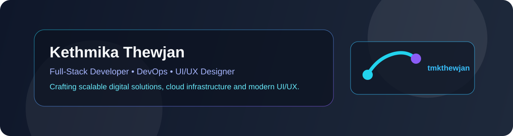

# 👋 Hello, I'm Kethmika Thewjan

  

  

  

## 🚀 About Me

I am a passionate **Full Stack Developer**, **DevOps Enthusiast**, and **UI/UX Designer** dedicated to architecting scalable digital products, cloud-ready backends, and visually captivating, human-centered web experiences.

My development ethos blends clean code craftsmanship, reliable CI/CD automation, and modern design systems. Whether developing complex MERN & Next.js web applications, building cross-platform mobile apps with React Native, containerizing services with Docker, or designing sleek Figma interfaces, I strive to build software that is both technically robust and delightful to use.

## ⚡ Core Disciplines

  
  
  
  
  
  

## 🛠️ Tech Stack

### 💻 Programming Languages

  

### 🎨 Frontend & UI/UX Design

  

### ⚙️ Backend & API Development

  

### ☁️ DevOps, Cloud & CI/CD

  

### 🗄️ Databases & Spatial Storage

  

## 📊 GitHub Analytics

  
  
  

  
  

  

## 🚀 Featured Projects

| Project | Description & Key Highlights | Tech Stack |
|---|---|---|
| [🇱🇰 **Explore Sri Lanka**](https://github.com/tmkthewjan/Explore-Sri-Lanka) | **Full-Stack Tourism & PostGIS Geolocation Discovery Platform** Modern spatial exploration platform featuring real-time GPS proximity detection (5km–50km radius), geodesic spatial queries with PostgreSQL/PostGIS GiST indexing, and interactive Mapbox GL navigation. | `Next.js 15 (App Router)`, `TypeScript`, `Tailwind CSS`, `Node.js`, `Express`, `PostgreSQL + PostGIS`, `Mapbox GL` |
| [🛒 **TechStore MERN**](https://github.com/tmkthewjan/Complete-TechStore-MERN-e-commerce-management-system) | **Full-Featured MERN E-Commerce & Inventory Management Suite** Production-grade online retail platform featuring an administrative portal, role-based JWT authentication, password reset workflows, cart & checkout state machines, and Supabase integration. | `React 19`, `Vite`, `Tailwind CSS`, `Node.js`, `Express`, `MongoDB (Mongoose)`, `Supabase`, `Nodemailer` |
| [🏋️‍♂️ **Royal Fitness**](https://github.com/tmkthewjan/gym-management-app) | **Cross-Platform Gym & Membership Management Mobile App** Mobile-first wellness & fitness ecosystem built with React Native and Expo Router v6. Includes member profile management, scheduling, secure token authentication, and multi-part asset handling. | `React Native (Expo SDK 54)`, `Expo Router v6`, `TypeScript`, `Node.js`, `Express`, `MongoDB`, `JWT`, `Multer` |
| [💻 **i-Computer Portal**](https://github.com/tmkthewjan/i-computer) | **Computer Sales & Hardware Service Management System** Full-stack web application designed for computer repair centers and electronics retailers, providing hardware catalog administration, customer auth, and repair tracking. | `React 19`, `Tailwind CSS`, `Node.js`, `Express`, `MongoDB`, `Axios`, `Bcrypt` |

## 🎯 Current Focus

- 🌐 **Modern Full-Stack Applications** — Building responsive, high-performance web applications leveraging Next.js 15 App Router, React 19, and scalable RESTful microservices.
- ⚙️ **DevOps & Cloud Automation** — Designing streamlined CI/CD pipelines, containerizing environments with Docker, and setting up automated deployments on Vercel and cloud platforms.
- 🎨 **UI/UX Design Systems** — Translating Figma wireframes and high-fidelity mockups into pixel-perfect, accessible, and intuitive interactive interfaces with Tailwind CSS.
- 🗺️ **Geospatial & Location-Aware Tech** — Exploring spatial data architectures, PostGIS spatial indexing, and interactive map visualizations.

## 🏆 Philosophy & Goals

- 💡 **Clean, Maintainable Code** — Writing modular, well-documented, and testable codebases.
- 🚀 **Automation First** — Automating repetitive workflows through continuous integration and deployment pipelines.
- 🎯 **User-Centric Design** — Prioritizing seamless user journeys, accessibility, and high visual polish.
- 📚 **Continuous Growth** — Exploring cutting-edge frontend libraries, cloud infrastructure patterns, and distributed systems.

## 🌐 Connect

  
  
  

## ☕ Metrics & Views

  
  
  

  <blockquote>
    <i>"Transforming ideas into resilient code and captivating user experiences."</i>
  </blockquote>

## 🐍 Contribution Snake

  

  

  <b>Thanks for visiting my profile — let's build something extraordinary together!</b>

